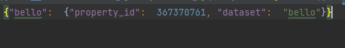

where to get ga4 auth: 
- https://developers.google.com/analytics/devguides/reporting/data/v1/quickstart-client-libraries

- make sure to rename json file to "gaauth.json"
- make sure to add client email found in json file to project access management found within admin settings of your GA4 property.


where to get GCP auth:
- console.cloud.google.com
- IAM & ADMIN 
- Service Accounts
-add service account with bigquery admin access
- add key to that service account with json file
- rename json file to "gcpauth.json"

need to create a properties.json file in this directory with the following structure: 

"bello" here is the name of the query, property_id is property id of your GA4 property, dataset is destination dataset name in bigquery for your table. 

export and upload can be done using the following command
```commandline
python GA4.py {queries} {GA4 properties}
```

